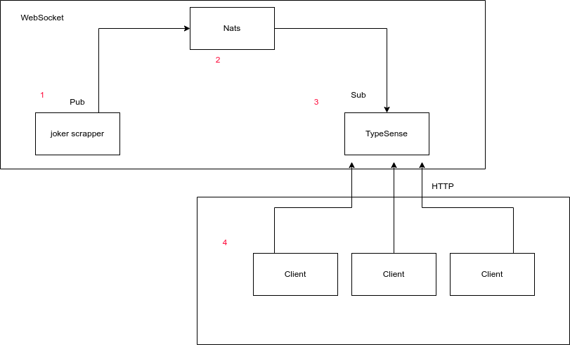

# Projeto de SD

  O [Projeto] tem como objetivo criar um sistema distribúido os os usuário poderão buscar, salvar e ranquear piadas de um um banco de dados de piadas.
  
## Tecnologias
- NodeJs
- Nats
- Typesense
- Reactjs

# Arquietura

## Front end client
https://www.figma.com/file/CQzJiFWNejofNgoTdzNWp3/Untitled?node-id=0%3A1

## Como rodar 

## Funcionalidades:
- Buscar piadas em um banco de piadas (filtrar e ordenar)
  - Filtragem por (ranking, data, palavra-chave, quantidade de palavras)   
- Salvar piadas
- Ranquear piadas
