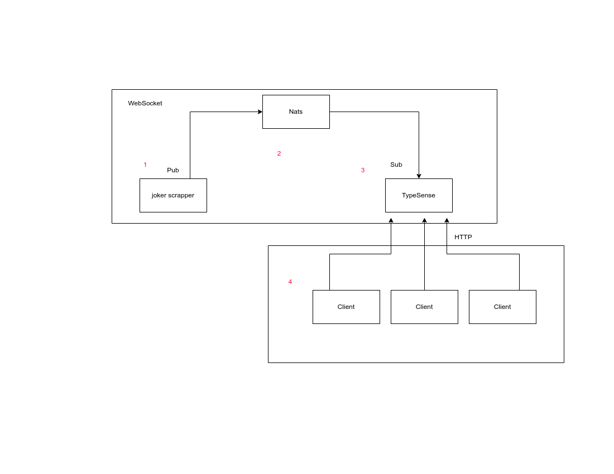

# **Joke Hub**

  O [Projeto] tem como objetivo criar um sistema distribúido os os usuário poderão buscar, salvar e ranquear piadas de um um banco de dados de piadas.
  
## **Funcionalidades:**
- Buscar piadas em um banco de piadas (filtrar e ordenar)
  - Filtragem por [ranking, data, palavra-chave]   
- Salvar piadas
- Ranquear piadas

## **Tecnologias**
- NodeJs
- Nats
- Typesense
- Reactjs
- Docker

## **Arquietura**


## Front end client
https://www.figma.com/file/CQzJiFWNejofNgoTdzNWp3/Untitled?node-id=0%3A1

# **Rodando cada aplicação**:

## **reddit-scrapepr**

Esse serviço tem como objectivo fazer um scraping dos subredits /jokes e /oneliners, e enviar esses dados para o tópico 'jokes' do nats. A linguagem implementada nesse projeto foi o python.

instalar dependências:
  asyncpraw
  asyncio
  nats
  
Comandos para rodar
  
```
pip install asyncpraw
pip install asyncio
pip install nats-py
pip install python-dotenv
python reddit-scrapper/main.py
```

## **sync-typesense**
O sync-typesense é uma aplicação que recebe mensagens do reddit scrapper através da ferramenta de messageria [nats](https://nats.io/), e syncroniza com o motor de busca [typesense](https://typesense.org/) inserindo cada mensagem no banco de dados gerenciado pelo próprio motor de busca, através de requisições http.

Navegue para o diretório sync-typesense
```
$ cd sync-typesense
```

### Primeiro instale as dependências:

```
$ yarn install
```

### Para realizar as funçôes do Sync Typesense é necessario seguir os seguintes passos:

Instale o Docker e docker-compose: [Docker](https://www.docker.com/get-started/),
 ou se preferir rodar o servidor localmente acesse [typesense](https://typesense.org/) para mais informações


### Iniciando o servidor em um container:

```
$ docker-compose up
```

### Criação a collection no typesense:

```
$ node src/collection/create.js
```

### Para remover a coleção:

```
$ node src/collection/delete.js
```

### Iniciando o serviço de sincronização

```
$ node src/index.js
```

### Modelos de coleções e documentos

### Jokes:

#### Collection

```JSON
{
    "name": "jokes",
    "fields": [
        {"name": "id", "type": "string", "optional": false},
        {"name": "joke", "type": "string", "optional": false},
        {"name": "date", "type": "string", "optional": true},
        {"name": "users", "type": "string[]", "optional": true},
        {"name": "rating_average", "type": "int32", "optional": true},
        {"name": "rating_amount", "type": "int32", "optional": true},
    ],
    "default_sorting": "date",
}
```

#### Document

```Js
{
    "id": "1",
    "joke": "joke content",
    "date": 1632229601, // data em que a piada foi publicada,
    "ratind_average": 4, // média das avaliações da piada
    "rating_amount": 10, // quantidade de avaliações
}
```

## **front-end**

### Primeiro instale as dependências:

```
$ npm install
```

### Inicie a aplicação com:

```
$ npm start
```

